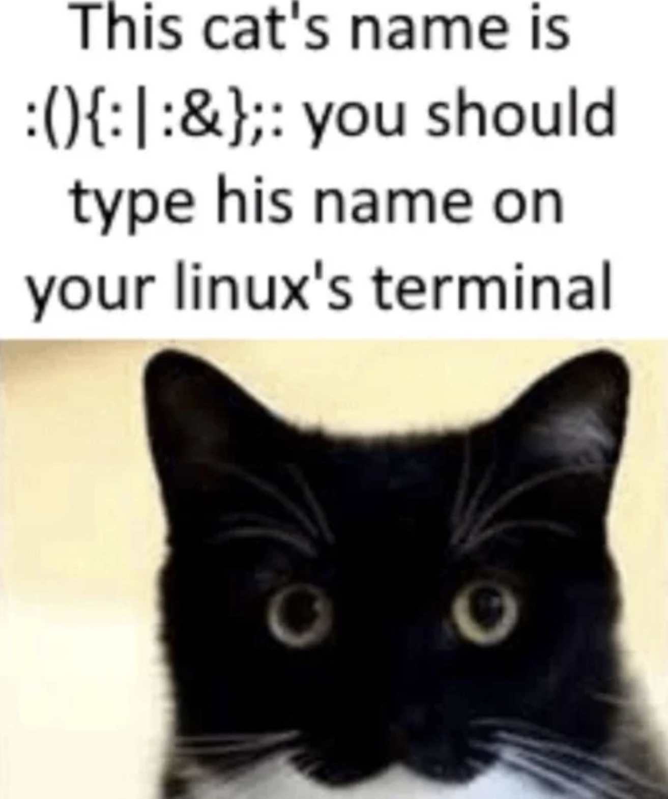

 ### Hello! I'm tuvalutorture! :D

I'm a hobbyist coder, who likes to make miscellaneous programs and OSes, using mostly C, but also wanting to learn Obj-C and Swift (maybe some c++ in the future, but i dont touch that nerd shit) :P 

check out this lovely project i'm actively working on that might get me sued by a trillion-dollar company! (or hopefully hired. always a non-zero chance amirite? *sobs violently* PLEASE HIRE ME RECRUITER MAN AT THE FRUIT CULT I SWEAR I PLEDGE MY LOYALTY TO STEVE JOBS AND TIMOTHY PLEASE) [MacInDOSh, a free, open source standalone x86 recreation of the Classic Mac OS!](https://github.com/turrnutorg/MacInDOSh)

[my playlist on yt. because nothing says coding like 75% chili peppers and 25% misc music.](https://www.youtube.com/playlist?list=PLmJ5F-0P_7Fos94aCj0AHz82Fozx6nWkU)

If you need to contact me for any reason, feel free to reach out at my email, tuvalutorture@icloud.com.

***p.s.***  
# please send peach schnapps my sanity is plummeting quickly. i cannot take C much longer make it stop make it stop make it stop make it stop make it stop make it stop make it stop make it stop make it stop make it stop make it stop make it stop make it stop make it stop make it stop make it stop make it stop make it stop make it stop make it stop make it stop make it stop make it stop make it stop

kefka from ffvi was kinda based and in the right ngl  
and his boss theme is my spirit animal  

## oh btw im 14 just fyi

### make sure to press enter after putting in his name

